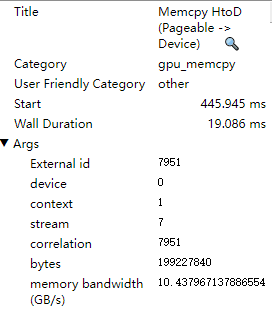
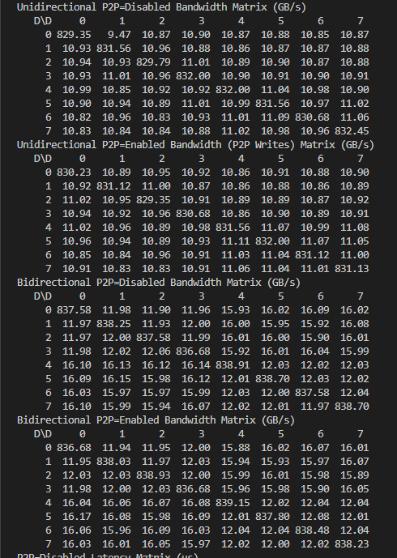
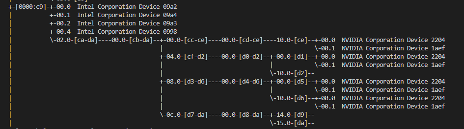
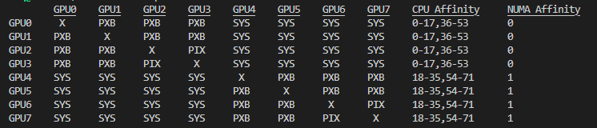

最近使用单卡4090训练模型发现模型训练速度较慢，定位发现样本数据从内存到GPU显存的`Memcpy HtoD` kernel的memory bandwidth只有10.4GB/s。

4090是支持pci 4.0的，根据[PCI_Express](https://en.wikipedia.org/wiki/PCI_Express), 16通道的pci 4.0可以有51.5GB/s的速度

通过命令`nvidia-smi --query-gpu=index,pcie.link.gen.current,pcie.link.gen.max,pcie.link.width.current --format=csv`, 查询发现`pci.len.gen.current`是`1`, 这个不符合预期，后面通过[链接](https://askubuntu.com/questions/1457183/nvidia-smi-reports-pcie-link-generation-to-be-1)发现，在GPU不使用的时候，GPU会主动调低这个指标, 跑模型训练的时候发现这个确实是`4`,符合预期。但是这个还是不符合HtoD只有10.4GB/s。

使用在`/usr/local/cuda/sample/1_Utilities/p2pBandwithLatencyTest`目录下nvidia自带的sample，测试卡之间的带宽， 只有11GB/s,且同一个numa内的GPU带宽低于跨numa！

通过`lspci -vt`查看发现，同一个numa内的GPU的通过pci bridge连接

通过`nvidia-smi topo -m`命令可以证实这一点

难道`HtoM`算子带宽低是应该pci bridge导致的？具体的原因还没有定位出来。